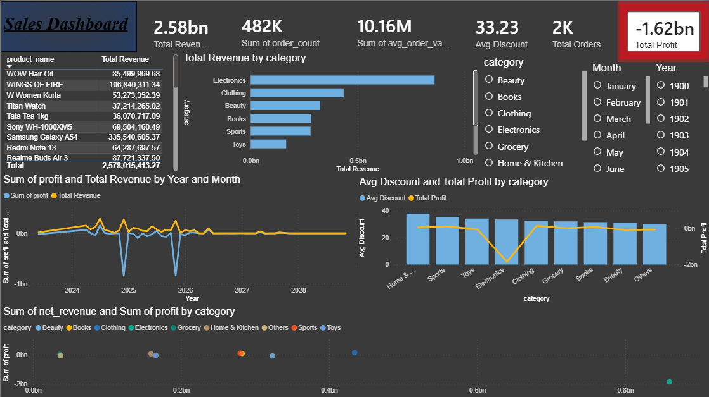

# 🛒 Online Store Sales Analysis & Dashboard

  

End-to-end data analytics solution for a multi-category Indian online
store — from raw data cleaning across **7 relational tables** to an
interactive Power BI dashboard delivering actionable business insights.

---

## 📦 Dataset Overview

| Attribute | Value |
|---|---|
| Raw Tables | 7 (customers, orders, order_items, products, payments, shipping, returns) |
| Categories | 9 (Electronics, Clothing, Beauty, Books, Sports, Toys, Home & Kitchen, Grocery, Others) |
| Date Range | 2024 – 2028 |
| Master Table | final_master_table (net_revenue + profit engineered) |

---

## 📊 Key KPIs

| Metric | Value |
|---|---|
| Total Revenue | ₹2.58 Billion |
| Total Orders | ~2,000 |
| Avg Order Value | ₹10.16 Million |
| Customer Retention Rate | 67.55% |
| Net Profit | -₹1.62 Billion |
| Avg Discount | ₹33.23 |
| Top Category | Electronics (₹193.7B · 174K orders) |
| Top Product | H&M Basic T-Shirt (₹89.1B) |

---

## 💡 Key Insights

- **Electronics dominated** — ₹193.7B revenue (174K orders); top category by significant margin
- **Clothing 2nd** at ₹143.3B · Books ₹135.1B · Sports ₹84.4B
- **Top products:** H&M Basic T-Shirt ₹89.1B · Atomic Habits ₹87.7B · Boldfit Yoga Mat ₹82.4B · Fire-Boltt Phoenix ₹57.2B
- **Net loss of -₹1.62B** despite ₹2.58B revenue — root cause: aggressive Electronics discounting with negative margins
- **Beauty collapsed -83% MoM** (Oct → Nov 2028: ₹175,791 → ₹28,999)
- **Clothing dropped to ₹0** in Nov 2028 from ₹111K in Oct — stock-out or supply chain failure
- **MoM volatility extreme** — +2,458% spike in Mar 2025 followed by -74% crash in Apr 2025
- **67.55% retention rate** — strong repeat buyer base but high-ticket one-time spikes indicate B2B profile

---

## 🔍 SQL Analysis

**Phase 1 — Data Validation (7 tables)**
- NULL checks across all primary keys and critical columns
- Duplicate detection via COUNT DISTINCT comparison
- Invalid email format detection (LIKE patterns)
- Price/quantity range validation (negative, zero, extreme values)
- Date format validation — mixed formats (YYYY-MM-DD and DD-MM-YYYY)
- Rating range check (1–5) for reviews table

**Phase 2 — Data Cleaning (8 cleaned tables)**
- `cleaned_customers` — ROW_NUMBER() deduplication by email, city name standardization (Bombay→Mumbai, Calcutta→Kolkata), segment normalization, future date correction
- `cleaned_products` — LIKE-based category re-classification across 8 categories, price/cost anomaly correction, (New) tag removal
- `cleaned_orders` — REGEXP date format detection, ABS() for negative amounts, STR_TO_DATE multi-format parsing
- `cleaned_order_items` — zero quantity imputed to 1, negative price correction
- `cleaned_payments` — ABS() for amount normalization
- `cleaned_returns` — refund cap at ₹100K, NULL refund handling
- `cleaned_reviews` — rating cap at 5, NULL review text replaced
- `cleaned_shipping` — COALESCE for status and courier name
- `final_master_table` — 4-table JOIN with engineered `net_revenue` and `profit` columns

**Phase 3 — KPI & Metrics Analysis**
- Total Revenue vs Raw Orders vs Actual Payments reconciliation
- Average Order Value and Customer Retention Rate (67.55%)
- Month-over-Month growth using LAG() window function with FIELD() ordering
- Revenue, profit, and order count per month/year

**Phase 4 — Trend & Comparative Analysis**
- Monthly revenue trends with MoM growth %
- Category-wise revenue, order count, avg order value
- Product-wise quantity and revenue ranking
- Customer-level lifetime spend ranking
- City-wise regional revenue analysis
- New vs Repeat customer segmentation

---

## 📈 Power BI Dashboard

### Sales Dashboard — Overview

KPI cards: ₹2.58B revenue · 482K order count · ₹10.16M AOV · ₹33.23 avg discount · 2K orders · -₹1.62B profit

Top products table (WOW Hair Oil · WINGS OF FIRE · Samsung Galaxy A54) | Category revenue bar (Electronics leads ₹1B+) | Profit & Revenue trend by Year/Month (2024–2028) | Avg Discount vs Total Profit by category | Net Revenue vs Profit scatter by category | Filters: Category · Month · Year

---

## 📁 Project Structure

    online-store-sales-analysis/
    ├── sql/
    │   ├── cleaning_and_processing.sql
    │   ├── KPI_and_Metrics_analysis.sql
    │   ├── SQL_Analysis.sql
    │   ├── Trend_and_Comparative_Analysis.sql
    │   └── dataset.sql
    ├── exports/
    │   ├── cleaned_data.csv
    │   ├── Category_Performance.csv
    │   ├── Monthly_Trend.csv
    │   ├── MoM_Growth.csv
    │   └── Top_Products.csv
    ├── dashboards/
    │   ├── task4_4.pbix
    │   └── screenshots/
    │       └── dashboard_overview.png
    ├── insights/
    │   └── my_insights.txt
    └── README.md

---

## ▶️ How to Run

1. Clone: `git clone https://github.com/Tushar-Khabrani/online-store-sales-analysis`
2. Import `sql/dataset.sql` into MySQL Workbench
3. Run `sql/cleaning_and_processing.sql` → creates all 8 cleaned tables + final_master_table
4. Run `sql/KPI_and_Metrics_analysis.sql` → KPI results
5. Run `sql/SQL_Analysis.sql` → customer, product, city analysis
6. Run `sql/Trend_and_Comparative_Analysis.sql` → MoM trends
7. Open `dashboards/task4_4.pbix` in Power BI Desktop

---

## 🤖 AI Integration
Used **Claude (Anthropic)** to optimize complex SQL queries, assist
with DAX formula logic in Power BI, and structure the business
insights report. All KPI selection, root cause analysis, and
dashboard design decisions independently made and validated.

---

## 🛠️ Tech Stack

`MySQL` · `Power BI` · `DAX` · `ETL` · `Data Cleaning`
`Window Functions` · `CTEs` · `Business Intelligence`

**Domain:** E-Commerce Analytics · Business Intelligence · Dashboarding

---

## 👤 Author
**Tushar Khabrani** — [LinkedIn](https://www.linkedin.com/in/tusharkhabrani104) · [GitHub](https://github.com/Tushar-Khabrani)
